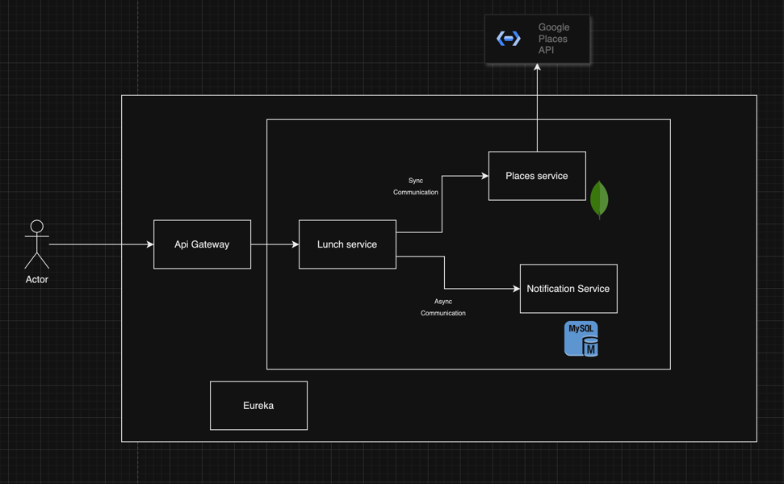

Base idea:

Lunch service - searches for restaurants, that offers lunch in a given area. If no result is present, it calls places-service to fetch data.
Places service - connects with google api. It is responsible for gathering, mapping and saving the data.
Notification service - Can send notification when new data is loaded or some pin was changed.